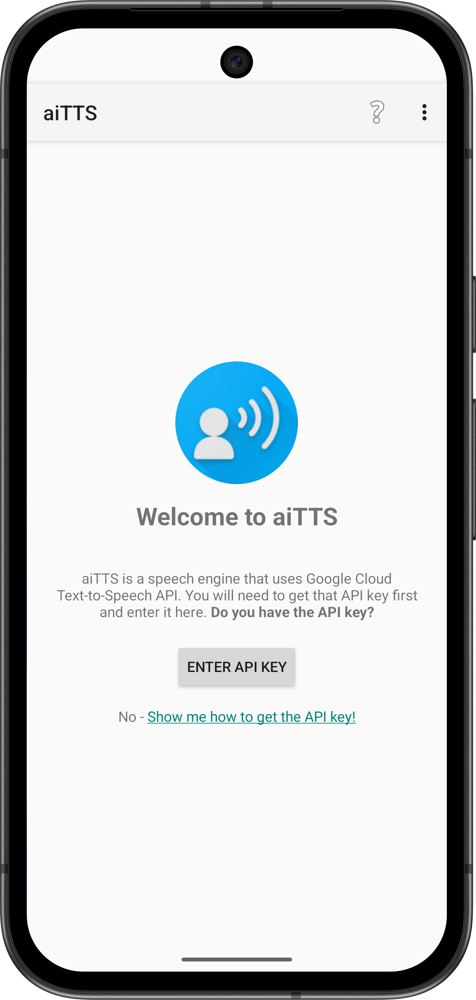
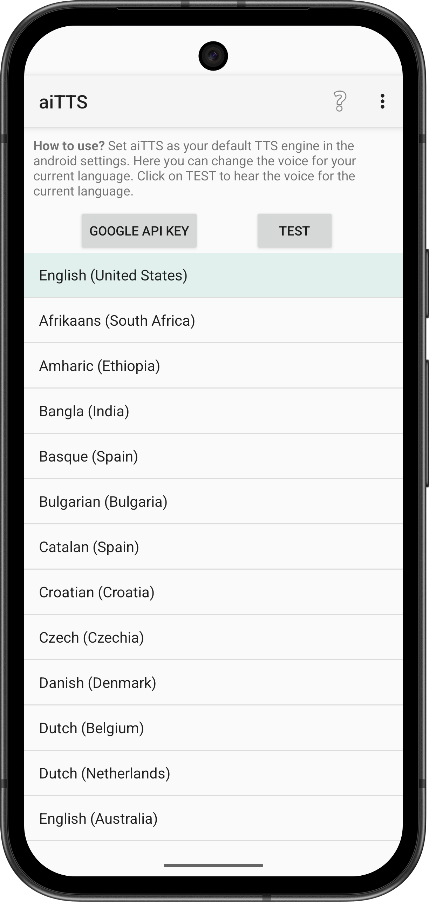
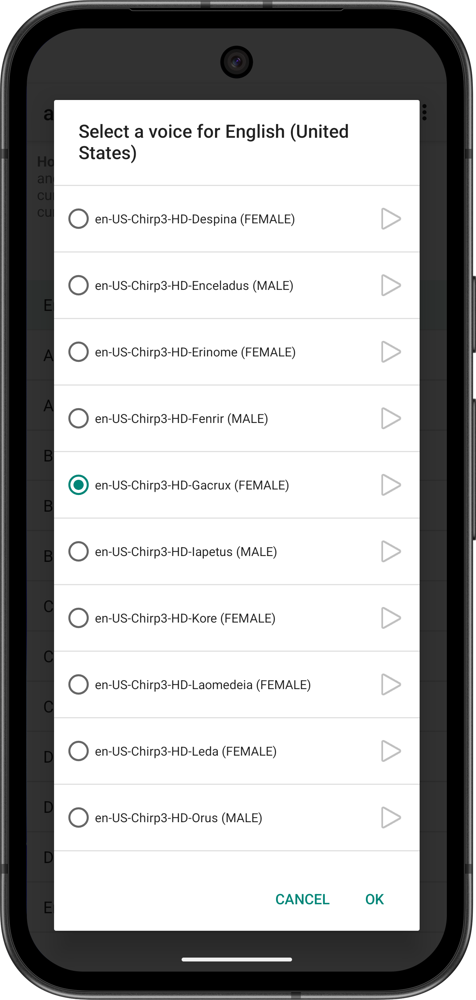

# aiTTS

aiTTS is a text to speech engine for android which is using the high qualty Google Text-To-Speech voices (eg.
wavenet, neural, journey, chirp, studio, etc.).

## Screenshots

Welcome screen:

Language list:

Voice list:

## How does it work?

here is the workflow:

- first you need to get a Google Cloud Text-To-Speech API Key. You can get it [here](https://docs.cloud.google.com/text-to-speech/docs/get-started). Check the pricing for the API, it is currently free for 1 million characters but it can vary between the voices (the quota resets every month).
- after setting this TTS engine as the default TTS engine in android, you can use it in any
  application that supports android TTS.
- the engine is receiving a chunk of text.
- the engine is downloading the audio file (using volley) from google using your own api key to the
  local storage (which is probably bad, but I didn't know how to do it better back then)
- the audio file is being converted using jlayer from mp3 to a wav
- the wav file is being streamed back and you start to hear the output

## License

This project is licensed under the MIT License.

You can use, copy, modify, and distribute it freely.
It is provided "AS IS", without warranty, and the authors are not liable for damages.

For third-party dependency and asset notices, see `THIRD_PARTY_NOTICES.md`.

---

Author: Michael Milawski - Millsoft
